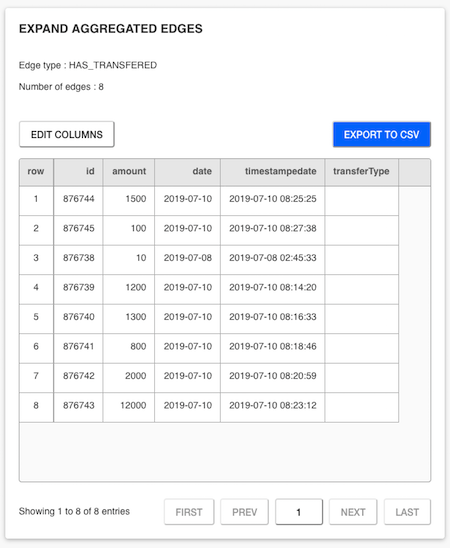

# Data-table plugin for Linkurious Enterprise

This Linkurious Enterprise plugin allow displaying the result of a
query (or query template) as a table.



## Configuration

This plugin supports the following configuration keys:

| Key | Type | Description | Example |
| :-- | :-- | :-- | :-- |
| `basePath`    | string (**optional**)            | A base path on which the plugin will be mounted. Defaults to `"data-plugin"`. | `"table"` |
| `debugPort`   | number (**optional**)            | A debug port on which to attach a debugger for the plugin NodeJS process. | `9230` |
| `entityType`  | "edge" \| "node" (**required**)  | Whether to display nodes or edges in the table. | `"node"` |
| `itemType`    | string (**optional**)            | Name of the node category or edge type to display in the table. | `"Company"` |
| `properties`  | string\[] (**optional**)         | Property names to include in the table. Defaults to all the properties of `itemType`. | `["name", "address", "vat_number"]` |

Full configuration example, via the [Linkurious Configuration](https://doc.linkurio.us/admin-manual/latest/configure/):


## URL parameters

This plugin supports the following URL parameters in the query string:

| Param | Type | Description | Example |
| :-- | :-- | :-- | :-- |
| `queryId`                     | integer (**required**)  | ID of the query to run. | `queryId=87` |
| `sourceKey`                   | string (**required**)   | Key of the data-source to run the query on. | `sourceKey=b16e9ed5` |
| `limit`                       | integer (**optional**)  | Maximum number of results to display. | `limit=500` |
| `param_number_{{Encoded field name}}` | number (**optional**)   | *For query templates*, any numerical parameter of the template | `param_number_age=30` |
| `param_string_{{Encoded field name}}` | string (**optional**)   | *For query templates*, any string parameter of the template | `param_string_city=Paris` |
| `param_ids_{{Encoded field name}}`    | comma-separated list (**optional**)  | *For query templates*, any edgeset/nodeset parameter of the template | `param_ids_target_ids=1,50,12` |

## Usage with standard queries

In order to display the result of a standard query in a table:

1. Create a standard READ query. For example: `MATCH (n) return n LIMIT 1000`.
2. Note down the newly-created query ID, it will by the value of `queryId`. For example: `queryId=87`.
3. Compose a valid data-table plugin URL and open it in a new tab.

You can either manually complete and open the following URL:
```
<your LKE base URL>/plugins/table?queryId=87&sourceKey=<a data-source key>
```
Or you can create the following [Custom Action](https://doc.linkurio.us/user-manual/latest/custom-actions/):
```
{{baseUrl}}plugins/table?queryId=87&sourceKey={{sourceKey}}
```
*When running a Custom Action, it will replace `{{baseUrl}}` and `{{sourceKey}}` for your LKE base URL and your current data-source key, respectively.*

## Usage with query templates

In order to display the result of a query template in a table:

1. Create a READ query template. For example: `MATCH (n) where n.city={{"City Name":string}} return n LIMIT 1000`.
2. Note down the newly-created query ID, it will by the value of `queryId`. For example: `queryId=19`.
2. Note down each field title, encode it, prepend it accordingly with a valid URL parameter and give it a value. For example: `param_string_City%20Name=Paris`.
3. Compose a valid data-table plugin URL and open it in a new tab.

You can either manually complete and open the following URL:
```
<your LKE base URL>/plugins/table?queryId=19&sourceKey=<a data-source key>&param_string_City%20Name=Paris
```
Or you can create the following [Custom Action](https://doc.linkurio.us/user-manual/latest/custom-actions/):
```
{{baseUrl}}plugins/table?queryId=19&sourceKey={{sourceKey}}&param_string_City%20Name=Paris
```
*When running a Custom Action, it will replace `{{baseUrl}}` and `{{sourceKey}}` for your LKE base URL and your current data-source key, respectively.*
